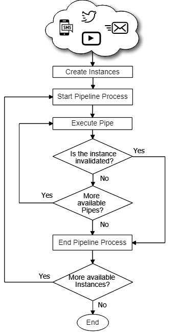
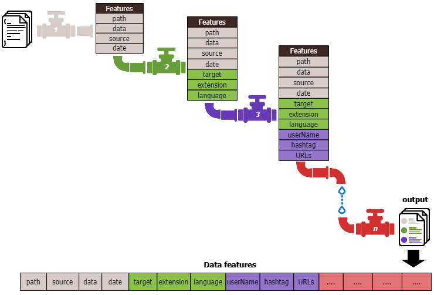

---
output:
  github_document: default
editor_options: 
  chunk_output_type: console
---
[](https://cran.r-project.org/package=bdpar)
[](https://github.com/metacran/cranlogs.app)
[](https://cran.r-project.org/package=bdpar)
[](https://travis-ci.org/miferreiro/bdpar)
[](https://www.tidyverse.org/lifecycle/#maturing)
[](https://codecov.io/gh/miferreiro/bdpar)


# Big Data Preprocessing Architecture

<div style = "text-align: justify">

bdpar is a a tool to easily build customized data flows to pre-process large volumes of information from different sources. To this end, bdpar allows to (i) easily use and create new functionalities and (ii) develop new data source extractors according to the user needs. Additionally, the package provides by default a predefined data flow to extract and preprocess the most relevant information (tokens, dates, ... ) from some textual sources (SMS, emails, tweets, YouTube comments).
</div>

## Description 📄

<div style = "text-align: justify">

In order to get the most out of the customization capabilities, the application has two modes of execution of the *Pipes*: 

  - Simple mode.
  - Advanced mode.

</div>

***

#### *Simple mode*

<div style = "text-align: justify">

The simple mode allows the tools to be executed through a single function in which the files and/or the folders that contains the files to be preprocessed, the flow of selected *Pipes* and the mode in which that the types of *Instances* are created. 

</div>

```R
output <- runPipeline(path,
                      extractors = ExtractorFactory$new(),
                      pipeline = DefaultPipeline$new())
```

#### *Advanced mode*

<div style = "text-align: justify">

The advanced mode allows (i) improve the customization of the tool and (ii) have a better control over the different stages of the preprocess. Specifically, it provides greater versatility in cases that want to modify the created object, for example, adding a function or an atribute that the user needs to realize their own preprocessing.

</div>

```R
bdpar_object <- Bdpar$new() 
bdpar_object$execute(path,
                     extractors = ExtractorFactory$new(),
                     pipeline = DefaultPipeline$new())
```

<div style = "text-align: justify">

The bdpar.Options object is used to store the different configuration parameters of the pipes used in the preprocessing. For example, to indicate the keys used to work with the APIs that require it (such as YouTube or Twitter) as well as various configuration parameters that allow to customize the behavior of the application such as the choice of text format to use in case there are multipart emails (plain text or text in html format). It is important to keep in mind that if the parameters are not needed, the value can be omitted.

The different options that exist initially and how their value is indicated to you are shown below.

</div>

```R
# [eml]
bdpar.Options$set("extractorEML.mpaPartSelected", <<PartSelectedOnMPAlternative>>)

# [resources]
bdpar.Options$set("resources.abbreviations.path", <<abbreviation.path>>)
bdpar.Options$set("resources.contractions.path", <<contractions.path>>)
bdpar.Options$set("resources.interjections.path", <<interjections.path>>)
bdpar.Options$set("resources.slangs.path", <<slangs.path>>)
bdpar.Options$set("resources.stopwords.path", <<stopwords.path>>)

# [twitter]
bdpar.Options$set("twitter.consumer.key", <<consumer_key>>)
bdpar.Options$set("twitter.consumer.secret", <<consumer_secret>>)
bdpar.Options$set("twitter.access.token", <<access_token>>)
bdpar.Options$set("twitter.access.token.secret", <<access_token_secret>>)
bdpar.Options$set("cache.twitter.path", <<cache.path>>)

# [teeCSVPipe]
bdpar.Options$set("teeCSVPipe.output.path", <<outputh.path>>)

# [youtube]
bdpar.Options$set("youtube.app.id", <<app_id>>)
bdpar.Options$set("youtube.app.password", <<app_password>>)
bdpar.Options$set("cache.youtube.path", <<cache.path>>)
```

<div style = "text-align: justify">

Regarding the flow of pipes used, the application provides a default flow implemented in the *DefaultPipeline* class. This method has been implemented in such a way that it picks up the exceptions thrown by the flow defined in the superclass, that is, the *execute* method of the *GenericPipeline* class. However, in order to adapt to the needs of each user, the application allows the design of new preprocessing flows. For this, it is necessary to create a class that inherits from *GenericPipeline* and implements the *execute* method. Another alternative is to directly use the *DynamicPipeline* class which allows you to manage the workflow through the functions it offers.

</div>

<div style = "text-align: justify">

Once a new preprocessing flow has been created, the user can both use and customize the 18 *Pipes* included by default in the application, as well as define *Pipes* that implement new functionalities. For this, it is necessary to create a class that inherits from *GenericPipe* and implements the new functionality within the *pipe* method. In the case of using *Pipes* by default, you can consult more information in the package documentation through the command *help(package = "bdpar")*.

</div>

<div style = "text-align: justify">

In case you want to introduce different types of extensions, you will first need to create a class that inherits from the *Instance* class which implements the abstract methods: *obtainSource* and *obtainDate*. In addition, you must execute *registerExtractor* function of *ExtractorFactory* class where it is necessary indicate the specific extension and the correspondant extractor.

On the other hand, the types of the files which are implemented by default are:

</div>

| File type             | Extension |
|:---------------------:|:---------:|
| SMS                   | .tsms     |
| Email                 | .eml      |
| ID Tweet              | .twtid    |
| ID comment of YouTube | .ytbid    |


## Operation mode ⚙



*Figure 1. Pipelining Operation process*



*Figure 2. Pipelining Operation example*

## Pre-requisites 📋

#### Required software

  - **R (\>= 3.5.0)**
  - **Python 2.7**

#### Required libraries

  - **Imports**:
  
|           | R Libraries | 
|:---------:|:-----------:|:------:|
| magrittr  | purrr       | R6     | 
| rlist     | tools       | utils  | 

  - **Suggests**:

|           | R Libraries |  
|:---------:|:-----------:|:---------:|
| cld2      | knitr       | readr     | 
| rex       | rjson       | rmarkdown |
| rtweet    | stringi     | stringr   |
| testthat  | tuber       |           |

##### Suggested configuration for not USA people

<div style = "text-align: justify">

In order to succesfully handle files following UTF-8 enconding, it is recommended to configure R environment with the parameters locale parameters “en\_US.UTF-8” (see Sys.getlocale() to check the default locale). Additionally, use Sys.setlocale() function to modify your R locale value.

</div>

## Installation 🔧 

#### Install the development version from GitHub:

``` r
devtools::install_github('miferreiro/bdpar')
```

## Build with 🛠️

  - [RStudio](https://www.rstudio.com/) 
    - The programming environment was used.
  - [roxygen2](https://cran.r-project.org/web/packages/roxygen2/index.html)
    - Uses to generate the documentation.

## Contributing 🖇️

<div style = "text-align: justify">

Please, read the <a href = https://github.com/miferreiro/bdpar/blob/master/CONTRIBUTING.md>CONTRIBUTING.md</a>
for details of our code of conduct, and the process to send us pull requests.

</div>

## Wiki 📖

You can find much more about how to use this project in our [Wiki](https://github.com/miferreiro/bdpar/wiki).

## Version 📌

We use [SemVer](http://semver.org/) for versioning. For all available versions, look at the [tags in this repository](https://github.com/miferreiro/bdpar/tags).

## Authors ✒️

  - **Miguel Ferreiro Díaz** - *Developer* - [miferreiro](https://github.com/miferreiro)
  - **David Ruano Ordás** - *Project Manager* - [drordas](https://github.com/drordas)
  - **Tomás R. Cotos Yañez** - *Project Manager* - [tomas-cotos](https://github.com/tomas-cotos)

You can see the list of all contributors on <https://github.com/miferreiro/bdpar/contributors>.

## Licence ⚖

This project is under the License GPL-3.
